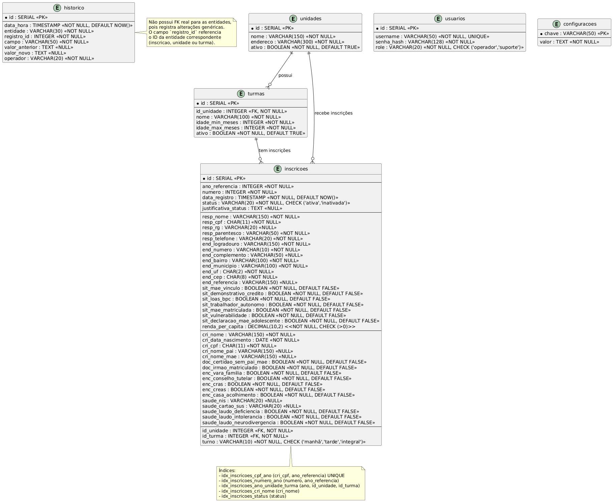

**Resposta registrada.** Usaremos `RESTRICT` (ou `NO ACTION`) para todas as chaves estrangeiras.

Para a geração do número da inscrição, adotarei a **Opção B (lógica na aplicação com transação e lock)**, por ser simples e garantir sequencial por ano. Isso será detalhado nas notas de implementação.

Agora, consolidarei o **Modelo Entidade-Relacionamento (MER) detalhado** com base em todas as definições anteriores.

---

# Modelo Entidade-Relacionamento Detalhado

**Sistema de Inscrição em Creches — Censo Anual de Demanda**

**Versão:** 1.1 (alinhada ao SRS e DAS)  
**Data:** Setembro de 2026  
**Licença:** GNU General Public License (GPL)

---

## 1. Visão Geral

O banco de dados é relacional (PostgreSQL) e possui as seguintes tabelas:

1. **unidades** – cadastro de creches (perene, gerenciado pelo suporte).  
2. **turmas** – turmas vinculadas a unidades (perene, gerenciado pelo suporte).  
3. **inscricoes** – tabela desnormalizada com todos os dados da inscrição (responsável, criança, solicitação).  
4. **historico** – registro de alterações em inscrições, unidades e turmas.  
5. **usuarios** – credenciais de acesso (operador e suporte).  
6. **configuracoes** – parâmetros do sistema (datas de campanha, diretórios).

---

## 2. Diagrama Entidade-Relacionamento (textual)

```
+-------------+          +----------------+
|  unidades   | 1    N   |    turmas      |
|-------------|<---------|----------------|
| id (PK)     |          | id (PK)        |
| nome        |          | id_unidade (FK)|
| endereco    |          | nome           |
| ativo       |          | idade_min_meses|
+-------------+          | idade_max_meses|
                          | ativo          |
                          +----------------+
                                  ^
                                  | N
                                  |
+-------------+          +----------------+
|  usuarios   |          |   inscricoes   |
|-------------|          |----------------|
| id (PK)     |          | id (PK)        |
| username    |          | ...            |
| senha_hash  |          | id_unidade (FK)|
| role        |          | id_turma (FK)  |
+-------------+          +----------------+
                                  |
                                  | 1
                                  v
                          +----------------+
                          |   historico    |
                          |----------------|
                          | id (PK)        |
                          | entidade       |
                          | registro_id    |
                          | campo          |
                          | valor_anterior |
                          | valor_novo     |
                          | operador       |
                          | data_hora      |
                          +----------------+

+-------------------+
|   configuracoes   |
|-------------------|
| chave (PK)        |
| valor             |
+-------------------+
```

---

## 3. Definição das Tabelas

### 3.1 Tabela `unidades`

| Coluna        | Tipo          | Constraints                          | Descrição                     |
|---------------|---------------|--------------------------------------|-------------------------------|
| `id`          | SERIAL        | PRIMARY KEY                          | Identificador único           |
| `nome`        | VARCHAR(150)  | NOT NULL                             | Nome da creche                |
| `endereco`    | VARCHAR(300)  | NOT NULL                             | Endereço completo             |
| `ativo`       | BOOLEAN       | NOT NULL, DEFAULT TRUE               | Indica se está ativa          |

**Índices adicionais:** Nenhum (consultas por id são raras; a listagem pode usar `ativo`).  
**Observações:** A exclusão física não é permitida; usa-se `ativo = FALSE` para desativar.

---

### 3.2 Tabela `turmas`

| Coluna            | Tipo          | Constraints                          | Descrição                      |
|-------------------|---------------|--------------------------------------|--------------------------------|
| `id`              | SERIAL        | PRIMARY KEY                          | Identificador único            |
| `id_unidade`      | INTEGER       | NOT NULL, REFERENCES unidades(id) ON DELETE RESTRICT ON UPDATE CASCADE | Unidade à qual pertence        |
| `nome`            | VARCHAR(100)  | NOT NULL                             | Ex.: "Berçário I"              |
| `idade_min_meses` | INTEGER       | NOT NULL, CHECK (idade_min_meses >= 0) | Idade mínima em meses          |
| `idade_max_meses` | INTEGER       | NOT NULL, CHECK (idade_max_meses >= idade_min_meses) | Idade máxima em meses          |
| `ativo`           | BOOLEAN       | NOT NULL, DEFAULT TRUE               | Indica se está ativa           |

**Índices adicionais:**
- `idx_turmas_unidade` em `(id_unidade)` – para listar turmas de uma unidade.

**Observações:** A faixa etária é armazenada em meses. O suporte cadastra/edita; não há vínculo com ano. A integridade entre unidades e turmas é garantida por FK.

---

### 3.3 Tabela `inscricoes`

Tabela desnormalizada que contém todos os dados da inscrição.

| Coluna                             | Tipo           | Constraints                                      | Descrição                                       |
|------------------------------------|----------------|--------------------------------------------------|-------------------------------------------------|
| `id`                               | SERIAL         | PRIMARY KEY                                      | Identificador único                             |
| `ano_referencia`                   | INTEGER        | NOT NULL, CHECK (ano_referencia >= 2000)         | Ano letivo de referência (ex.: 2027)            |
| `numero`                           | INTEGER        | NOT NULL                                         | Número sequencial por ano (gerado pela aplicação)|
| `data_registro`                    | TIMESTAMP      | NOT NULL, DEFAULT NOW()                          | Data e hora da criação                          |
| `status`                           | VARCHAR(20)    | NOT NULL, DEFAULT 'ativa', CHECK (status IN ('ativa','inativada')) | Situação da inscrição                           |
| `justificativa_status`             | TEXT           |                                                  | Justificativa para inativação/reativação        |
| **Dados do Responsável**           |                |                                                  |                                                 |
| `resp_nome`                        | VARCHAR(150)   | NOT NULL                                         | Nome completo                                   |
| `resp_cpf`                         | CHAR(11)       | NOT NULL                                         | CPF (somente dígitos)                           |
| `resp_rg`                          | VARCHAR(20)    |                                                  | RG                                              |
| `resp_parentesco`                  | VARCHAR(50)    | NOT NULL, CHECK (resp_parentesco IN ('mãe','pai','responsável legal','familiar','cuidador')) | Parentesco com a criança                        |
| `resp_telefone`                    | VARCHAR(20)    | NOT NULL                                         | Telefone de contato                             |
| `end_logradouro`                   | VARCHAR(150)   | NOT NULL                                         | Endereço (logradouro)                           |
| `end_numero`                       | VARCHAR(10)    | NOT NULL                                         | Número                                          |
| `end_complemento`                  | VARCHAR(50)    |                                                  | Complemento (opcional)                          |
| `end_bairro`                       | VARCHAR(100)   | NOT NULL                                         | Bairro                                          |
| `end_municipio`                    | VARCHAR(100)   | NOT NULL                                         | Município                                       |
| `end_uf`                           | CHAR(2)        | NOT NULL                                         | UF (sigla)                                      |
| `end_cep`                          | CHAR(8)        | NOT NULL                                         | CEP (somente dígitos)                           |
| `end_referencia`                   | VARCHAR(150)   |                                                  | Ponto de referência (opcional)                  |
| `sit_mae_vinculo`                  | BOOLEAN        | NOT NULL, DEFAULT FALSE                          | Mãe com vínculo empregatício                    |
| `sit_demonstrativo_credito`        | BOOLEAN        | NOT NULL, DEFAULT FALSE                          | Possui demonstrativo de crédito/benefício       |
| `sit_loas_bpc`                     | BOOLEAN        | NOT NULL, DEFAULT FALSE                          | Recebe LOAS/BPC/seguro-desemprego               |
| `sit_trabalhador_autonomo`         | BOOLEAN        | NOT NULL, DEFAULT FALSE                          | Trabalhador autônomo                            |
| `sit_mae_matriculada`              | BOOLEAN        | NOT NULL, DEFAULT FALSE                          | Mãe matriculada em rede pública de ensino       |
| `sit_vulnerabilidade`              | BOOLEAN        | NOT NULL, DEFAULT FALSE                          | Situação de vulnerabilidade social              |
| `sit_declaracao_mae_adolescente`   | BOOLEAN        | NOT NULL, DEFAULT FALSE                          | Declaração escolar de mãe adolescente           |
| `renda_per_capita`                 | DECIMAL(10,2)  | NOT NULL, CHECK (renda_per_capita > 0)           | Renda per capita familiar (obrigatória)         |
| **Dados da Criança**               |                |                                                  |                                                 |
| `cri_nome`                         | VARCHAR(150)   | NOT NULL                                         | Nome completo                                   |
| `cri_data_nascimento`              | DATE           | NOT NULL                                         | Data de nascimento                              |
| `cri_cpf`                          | CHAR(11)       | NOT NULL                                         | CPF (somente dígitos)                           |
| `cri_nome_pai`                     | VARCHAR(150)   |                                                  | Nome do pai (opcional)                          |
| `cri_nome_mae`                     | VARCHAR(150)   |                                                  | Nome da mãe (opcional)                          |
| `doc_certidao_sem_pai_mae`         | BOOLEAN        | NOT NULL, DEFAULT FALSE                          | Certidão sem pai/mãe                            |
| `doc_irmao_matriculado`            | BOOLEAN        | NOT NULL, DEFAULT FALSE                          | Irmão já matriculado na rede                    |
| `enc_vara_familia`                 | BOOLEAN        | NOT NULL, DEFAULT FALSE                          | Encaminhamento Vara da Família                  |
| `enc_conselho_tutelar`             | BOOLEAN        | NOT NULL, DEFAULT FALSE                          | Encaminhamento Conselho Tutelar                 |
| `enc_cras`                         | BOOLEAN        | NOT NULL, DEFAULT FALSE                          | Encaminhamento CRAS                             |
| `enc_creas`                        | BOOLEAN        | NOT NULL, DEFAULT FALSE                          | Encaminhamento CREAS                            |
| `enc_casa_acolhimento`             | BOOLEAN        | NOT NULL, DEFAULT FALSE                          | Encaminhamento Casa de Acolhimento              |
| `saude_nis`                        | VARCHAR(20)    |                                                  | NIS (opcional)                                  |
| `saude_cartao_sus`                 | VARCHAR(20)    |                                                  | Cartão SUS (opcional)                           |
| `saude_laudo_deficiencia`          | BOOLEAN        | NOT NULL, DEFAULT FALSE                          | Laudo de deficiência ou neoplasia               |
| `saude_laudo_intolerancia`         | BOOLEAN        | NOT NULL, DEFAULT FALSE                          | Laudo de intolerância alimentar                 |
| `saude_laudo_neurodivergencia`     | BOOLEAN        | NOT NULL, DEFAULT FALSE                          | Laudo de neurodivergência                       |
| **Solicitação de Vaga**            |                |                                                  |                                                 |
| `id_unidade`                       | INTEGER        | NOT NULL, REFERENCES unidades(id) ON DELETE RESTRICT ON UPDATE CASCADE | Unidade pretendida                              |
| `id_turma`                         | INTEGER        | NOT NULL, REFERENCES turmas(id) ON DELETE RESTRICT ON UPDATE CASCADE | Turma pretendida                                |
| `turno`                            | VARCHAR(10)    | NOT NULL, CHECK (turno IN ('manhã','tarde','integral')) | Turno desejado                                  |

**Índices adicionais:**
- `idx_inscricoes_cpf_ano` em `(cri_cpf, ano_referencia)` – verificação de duplicidade.
- `idx_inscricoes_numero_ano` em `(numero, ano_referencia)` – busca por número.
- `idx_inscricoes_ano_unidade_turma` em `(ano_referencia, id_unidade, id_turma)` – relatórios por unidade/turma.
- `idx_inscricoes_cri_nome` em `(cri_nome)` – busca por nome (com LIKE).
- `idx_inscricoes_status` em `(status)` – filtro por status.

**Constraints adicionais:**
- `UNIQUE (cri_cpf, ano_referencia)` – impede duas inscrições da mesma criança no mesmo ano.
- `CHECK (cri_data_nascimento <= CURRENT_DATE)` – data de nascimento não pode ser futura (opcional, mas recomendado).
- `CHECK (renda_per_capita > 0)` – renda positiva.

**Observações sobre geração do número:**  
O campo `numero` é sequencial por ano. A aplicação deve, dentro de uma transação, consultar `MAX(numero) WHERE ano_referencia = X` e incrementar. Para evitar concorrência, usar `SELECT ... FOR UPDATE` na tabela `configuracoes` (ou uma tabela de sequência) ou simplesmente contar com o isolamento da transação. Como o sistema é monousuário, a probabilidade de conflito é mínima.

---

### 3.4 Tabela `historico`

| Coluna           | Tipo          | Constraints                        | Descrição                            |
|------------------|---------------|------------------------------------|--------------------------------------|
| `id`             | SERIAL        | PRIMARY KEY                        | Identificador único                  |
| `data_hora`      | TIMESTAMP     | NOT NULL, DEFAULT NOW()            | Data/hora do evento                  |
| `entidade`       | VARCHAR(30)   | NOT NULL, CHECK (entidade IN ('inscricao','unidade','turma')) | Entidade afetada                     |
| `registro_id`    | INTEGER       | NOT NULL                           | ID do registro alterado (não é FK)   |
| `campo`          | VARCHAR(50)   | NOT NULL                           | Nome do campo alterado               |
| `valor_anterior` | TEXT          |                                    | Valor anterior (pode ser NULL)       |
| `valor_novo`     | TEXT          |                                    | Novo valor (pode ser NULL)           |
| `operador`       | VARCHAR(20)   | NOT NULL DEFAULT 'operador'        | Usuário que realizou a alteração     |

**Índices:**
- `idx_historico_entidade_registro` em `(entidade, registro_id)` – consulta por entidade e registro.
- `idx_historico_data` em `(data_hora)` – consulta por período (opcional).

**Observações:**  
`registro_id` não possui FK polimórfica, pois pode referenciar `inscricoes.id`, `unidades.id` ou `turmas.id`. A integridade é garantida pela aplicação.

---

### 3.5 Tabela `usuarios`

| Coluna       | Tipo          | Constraints                          | Descrição                    |
|--------------|---------------|--------------------------------------|------------------------------|
| `id`         | SERIAL        | PRIMARY KEY                          | Identificador único          |
| `username`   | VARCHAR(50)   | NOT NULL, UNIQUE                     | Nome de usuário              |
| `senha_hash` | VARCHAR(128)  | NOT NULL                             | Hash bcrypt da senha         |
| `role`       | VARCHAR(20)   | NOT NULL, CHECK (role IN ('operador','suporte')) | Papel do usuário             |

**Índices:** Nenhum adicional (username já é único).

**Observações:**  
Serão criados ao menos dois registros: um para `operador` e outro para `suporte`. O hash utiliza bcrypt.

---

### 3.6 Tabela `configuracoes`

| Coluna  | Tipo         | Constraints     | Descrição                    |
|---------|--------------|-----------------|------------------------------|
| `chave` | VARCHAR(50)  | PRIMARY KEY     | Nome da configuração         |
| `valor` | TEXT         | NOT NULL        | Valor da configuração        |

**Exemplos de chaves:**
- `campanha_inicio` → `2026-09-01`
- `campanha_fim` → `2026-10-31`
- `diretorio_backup_json` → `/home/operador/sicrem/backups`
- `diretorio_backup_banco` → `/home/operador/sicrem/backups_banco`

**Observações:**  
Tabela simples de chave-valor, usada para parâmetros do sistema sem necessidade de alteração de código.

---

## 4. Relacionamentos e Integridade

- **unidades 1—N turmas**  
  - FK: `turmas.id_unidade` → `unidades.id`  
  - Ação: `ON DELETE RESTRICT`, `ON UPDATE CASCADE`

- **unidades 1—N inscricoes**  
  - FK: `inscricoes.id_unidade` → `unidades.id`  
  - Ação: `ON DELETE RESTRICT`, `ON UPDATE CASCADE`

- **turmas 1—N inscricoes**  
  - FK: `inscricoes.id_turma` → `turmas.id`  
  - Ação: `ON DELETE RESTRICT`, `ON UPDATE CASCADE`

- **historico** não tem FK para entidades, apenas guarda o `registro_id`.

- **usuarios** e **configuracoes** são independentes.

---

## 5. Considerações de Implementação

- **Geração do número da inscrição**:  
  Recomenda-se uma transação com `SELECT MAX(numero) FROM inscricoes WHERE ano_referencia = :ano FOR UPDATE` ou, alternativamente, manter uma tabela `sequencias` para cada ano. Como o sistema é local e monousuário, a simplicidade é preferível.

- **Máscaras e validação**:  
  A aplicação deve remover máscaras antes de persistir CPF, CEP e telefone. O banco armazena apenas dígitos.

- **Campos booleanos**:  
  Checkboxes são enviados como `1`/`0` ou `true`/`false`, convertidos para `BOOLEAN`.

- **Cálculo de idade**:  
  Feito na aplicação (Python), baseado na data de corte (31/03 do ano de referência) e na data de nascimento.

- **Inativação/reativação**:  
  Apenas altera o campo `status` e registra justificativa; não remove registros.

- **Backup e JSON**:  
  Os JSONs são gerados espelhando a linha da tabela `inscricoes` com todos os campos.

---

## 6. Diagrama Completo (Opcional – representação gráfica)


